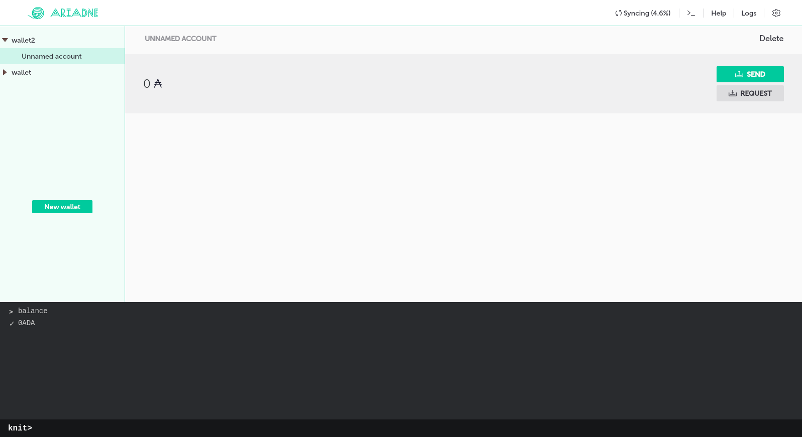

# Ariadne GUI usage guide

Ariadne GUI is made with Qt framework and is a completely native application that looks and feels
the same on Linux, Windows and macOS. This document will present you the most of its features.

## Overview

When you launch `ariadne-qt` the main window appears.

This window has several parts. On the top there is a bar with the logo and some buttons. Most
important part of that bar is syncing indicator &mdash; it will show whether Ariadne is synced with
the blockchain network, with a percentage of downloaded blocks. If you want more detail, hover your
mouse over the indicator and you'll see the status of local database and network one.

"Logs" button on the top bar will show you all the logs produced by the embedded blockchain node.
">_" button opens Knit command line and "Help" button shows reference for knit commands. Knit will
be covered later in this text.

The rest of the window is divided in two parts: wallet tree to the left and wallet pane to the
right. In the wallet tree you will see all your wallets and their accounts and wallet pane will give
you information about the currently selected wallet and actions you can do with it.

## Wallet management

On the first run the wallet tree will be empty. To create a new wallet press the "New wallet"
button and a dialog will open. You can choose to create a completely new wallet or restore one from
mnemonic by clicking on the dialog header and choosing the appropriate option.

In any case you will need to enter a name for the new wallet and choose a password, if you want to.
When restoring wallet you can also choose whether to perform full restore &mdash; i.e. whether to
search the blockchain for all used accounts of that wallet.

When everything is filled right, click the "CREATE" button.

If you are creating a completely new wallet, a new dialog will appear, giving you the mnemonic to
your new wallet. As safety of this mnemonic is extremely important, the dialog takes extra steps to
make sure that you wrote that mnemonic somewhere safe. To verify that, you will be asked to first
write down the mnemonic, e.g. to a piece of paper, and then type it back into Ariadne. If the
mnemonic matches, the wallet will be actually created. If, however, you fail to confirm your
mnemonic, you have to start the process from the beginning.

Once the wallet is created you can select it in the wallet tree. On the right you will see its name
and balance. Also there will appear a "Create account" button. Evey new wallet will automatically have
one account and one address in that account.

When there are too many accounts in a wallet and you don't need to see all of them, you can fold it
by clicking on the triangle left of the wallet's name.

If you want to delete an account or a wallet, just click "Delete" button in the wallet pane. Since
deleting a wallet is a rather dangerous operation, you will be asked to enter its name to confirm
you understand what you are doing.

When an account is selected you can open its settings by clicking the "Account settings" button in
the wallet pane. A dialog will open where you can change your account's name or delete it.

## Blockchain operations

Wallet pane has two buttons for working with the blockchain &mdash; "SEND" and "REQUEST". Both will
be visible only if the selected wallet has at least one account.

### Receiving transactions

To receive a transaction in the blockchain from someone you need to give that someone one of your
addresses. You can access the list of all your addresses by clicking the "REQUEST" button in the
wallet pane. If you click it when a wallet is selected you will see addresses of all its accounts,
otherwise you will see addresses of only the selected account.

Each address is annotated with its balance and a "Copy address" button. Click on this button will
copy the address to system clipboard.

If you need a new address, click "GENERATE NEW ADDRESS" button. You will be asked for wallet
password if it's password protected. After generation new address will be appended to the list.

### Sending transactions

As with requesting, you can click "SEND" when either wallet or account is selected. A send dialog
will open, where you can enter the amount you want to send and receiver's address. If you click
"SEND" on a wallet, you will have to choose accounts to use as inputs as well. Click on "select
accounts..." text right of "FROM" and a pop-up will appear, giving you the list of the current
wallet's accounts along with their balances. Select desired accounts by clicking on their names and
close the drop-down by clicking anywhere outside it. If you don't select any accounts, Cardano
backend will select some based on default input selection strategy.

Remember that in Cardano you can not have a fraction of ADA less than 0.000001 (10⁻⁶).

If the amount and receiver's address are correct, "SEND" button will activate. If your wallet is
password-protected, you will be asked to enter your password. After that the wallet will try to
send your transaction and will display its hash in a message box if everything goes OK. If, however,
some error arises, it will be displayed.

### Using password protected wallets

Ariadne has a built-in password manager that behaves like `sudo` command. When doing any operation
that requires wallet's password, like sending a transaction, a password prompt dialog will open.
If your wallet has password, check the checkbox in that dialog and enter your password, otherwise
leave the checkbox unchecked. Correctly entered password will be stored for 5 minutes after last
use. If 5 minutes pass and you did not do any new password-requiring operations, password will be
removed from memory.

## Using Knit command language

Under the hood all operations that Ariadne does are represented as command in Knit language designed
specifically for this task. For more experienced users we offer a way to use this language directly.

To do so, click "`>_`" button in the top bar and Knit repl will appear on the bottom of the window.
There you can enter commands and execute them by clicking `Enter`. Output of every command consists
of two rows: first one starts with "`>`" and contains the command you entered. The second one has
check mark, cross mark or hourglass signal with command id underneath it. Check and cross mean command
success and failure respectively, with command output right of them. Hourglass symbol indicates that
command is still executing. You can start several commands at the same time and they will be
executed asynchronously. To stop some long-running command you can use `kill` command with command's
id enclosed in `<>`.

For a in-detail reference of Knit language please refer to the
[relevant part of terminal UI user guide](usage-tui.md#knit-command-language). All commands work
exactly the same way in GUI version of Ariadne.
