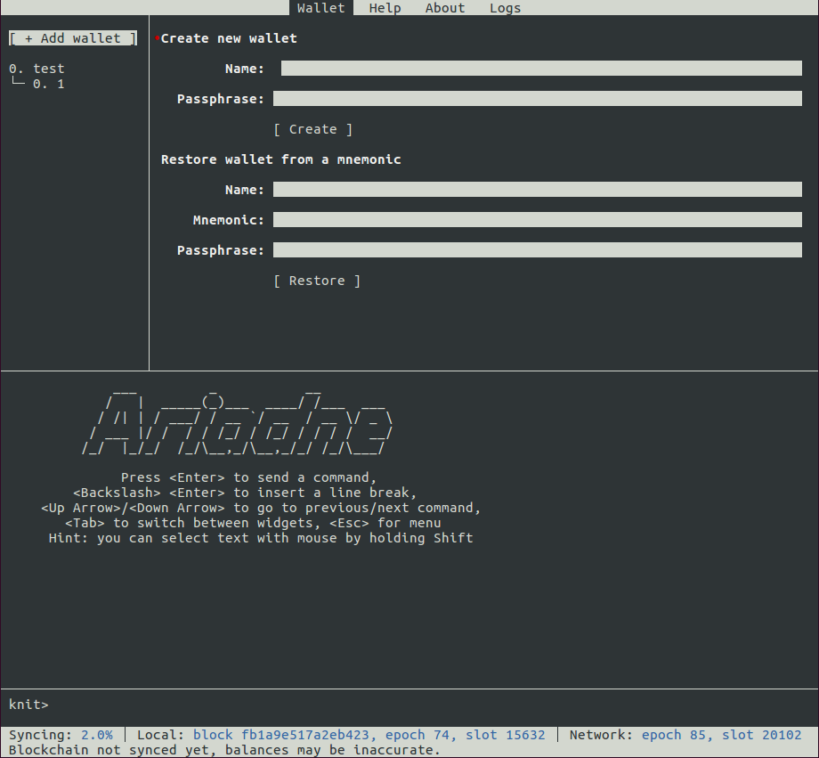

# Ariadne TUI user guide

This is a user guide for Ariadne text-based user interface (TUI), which runs in any terminal
emulator.

## About mouse support

Note that almost any action accomplishable with keyboard can also be performed with a mouse in an
intuitive way. This guide will mostly focus on keyboard shortcuts, mentioning mouse where its usage
is not obvious.

Also please note that while Ariadne has no native support for text selection with mouse (yet), you
can still select text by using your terminal emulator's features. On Linux you usually need to hold
`Shift` while selecting. On macOS try holding `Alt` or `Fn` or consult your terminal emulator's
documentation.

## Screen layout and navigation

Ariadne window consists of several tabs, presented at the top of the screen. Each tab has some
widgets.



There are two ways of navigating the tabs and widgets: with shortcuts and by using `Tab` key.  To
access shortcuts press `Esc` key. Each tab and each widget will get a red underlined letter in front
of them. To switch to the desired widget, press the corresponding letter. For example, to switch to
the logs tab, press `Esc` and then `l`. Currently active widget will get a red dot on its first line
and brighter text.

The `Tab` key provides you with the usual cyclic navigation: pressing `Tab` moves selection one
widget forward and pressing `Shift-Tab` &mdash; one widget backward.

Here are all the tabs present in Ariadne:
- `Wallet`: main tab, where you can do all wallet operations
- `Help`: a short help about `Knit` commands
- `About`: an about screen, with licensing information
- `Logs`: logs from an embedded Cardano node, which may be useful should something go wrong

All widgets that have a lot of text (e.g. About and Logs) can be scrolled with mouse, arrow keys or
`j`/`k` keys.

## Wallet tab &mdash; the heart of Ariadne

On the `Wallet` tab you can see all your wallets with their accounts and addresses organized in a
tree. To the right of the tree you can see details of the selected wallet, account or address.

To create a new wallet, select `[ + Add wallet ]` line in the tree, so that a special widget appears
to the right. There you can either create a completely new wallet by specifying its name and a
passphrase, or restore an existing one. When a new wallet is created, Ariadne will print you its
mnemonic. **Please save it somewhere safe**.

Note that Ariadne mnemonics have more words than 12-words mnemonics of Daedalus, and that the last
word of the mnemonic is always fixed (currently it is `ariadne-v0`).  This means you won't be able
to use your Ariadne wallet in Daedalus. However, you can import your Daedalus wallet into Ariadne
using the 12 words mnemonic.

When you select a wallet, you can see its balance and send some transactions with a special form.
When an address is selected, you can copy it to the clipboard using `[ Copy ]` button in order to
share it with someone who wants to send you money. This works out of the box on macOS, on Linux you
have to have either `xclip` or `xsel` installed.

On the bottom half of the screen you see the REPL widget which consists of command history and an
input line. The REPL lets you do all sorts of things with your wallet using `Knit` command language.
In fact, all operations you do with widgets are mapped to some `Knit` commands.

## `Knit` command language

`Knit` is a simple dynamically-typed command language created by Serokell. It lets you control
Ariadne by calling and composing functions. On the `Help` tab you can see a complete list of all
available functions, along with their signatures and short descriptions. Let's explore `Knit` syntax
and these functions in more detail.

### General syntax

To begin with, all `Knit` functions accept keyword arguments, some of which may be optional.
Optional arguments are marked with "`?`" suffix in the help. If an
argument can be specified many times (including zero), it's marked
with "`*`" suffix. If it can be specified many times, but at least
once, it's marked with "`+`" suffix. To specify a keyword argument, write
its name followed by `:` and the value. Types are checked while executing the command, not when
parsing it.  Functions may also have variable number of arguments.

Let's take `print` command for example. It expects a single argument named "`value`" of any type. To
run it, type in the REPL:

    print value: "test"

Here we call `print` command passing it the string `"test"` as a value for `"value"` argument. Of
course, you can omit argument names, specifying them in the same order as in help:

    print "test"

You can also specify some of the command's optional arguments without specifying others. For
example, `new-wallet` command creates a new wallet and expects three arguments: `pass`, `name` and
`entropy-size`. You can either call it with both passphrase and name, omitting argument names:

    new-wallet "cat" "test"

Or, if you want to use the default (empty) passphrase, but need to give the wallet a name, you can
specify only the second argument:

    new-wallet name: "test"

`Knit` language has literals of several formats:

- Strings in double quotes (`"string"`)
- Numbers with or without decimal point (`1`, `0.5`) or in scientific form (`1e-6`)
- ADA coin amounts (`1.5ADA`, see below)
- Cardano addresses without quotes (`sxtitePxjp5dcfm1u8gWgDBGMCEZMhGa6kUPu8VHhqpCtBDPExrJTTCCUHKkyEJSgjb41JT5Tfh1QXb7uUpgjyBKMw`)
- Task ids (`<1>`, see below)
- File paths, either relative or absolute, without quotes (`./file.txt`, `/etc/file.txt`)

Let's first cover `Knit` commands that are not related to cryptocurrency. There are not many:

- `L`: create a list of things. Call it with any number of arguments, which may be of different
    types:

 ```
 L 1 2 3 "a" "b" "c"
 ```

- `help` and `logs`: switch to Help and Logs tabs respectively
- `print`: print an argument of any type
- `sleep`: delay execution for a given number of microseconds
- `not`, `true` and `false`: boolean negation and two boolean literals

Aside from that you can enter multiple commands in one input. To do so, separate the commands with
`;`.  REPL widget input line also allows you to break lines for visual stylization of commands. If
you enter a backslash (`\ `) and press the Enter key, a new input line will appear.

All `Knit` commands are executed asynchronously, giving you back the control of REPL right after you
press Enter. Ariadne has a task manager for these background commands.  When you run some
long-running task, its id (a number in angle brackets like `<1>`) and a string `"Waiting for
result"` will appear. To cancel a command, use `kill` command like so:

    kill <1>

You can also make some commands depend on others by using `wait` command with a specific task id.

### User interface and Knit integration

Some of the `Knit` functions may access the internal state of Ariadne UI &mdash; namely, currently
selected wallet, account or address. This allows you to omit the wallet name when creating a new
account using `new-account` command &mdash; it will use the currently selected one. There is also a
`copy-selection` command, which will copy the name of selected item (wallet, account or address) to
the system clipboard.

### Cardano-related commands

Finally, to the commands which will help you manage your `ADA` wallet. Each command will be
annotated with its arguments and their types. Optional arguments will be marked with "`?`".

- `new-wallet pass: String? name: String? entropy-size: Int?`: create a new wallet with a
    passphrase, name and size of entropy. Size of entropy influences security of your wallet and the
    length of the mnemonic. Default value is 16 bytes, leading to mnemonics of 13 words. Ariadne
    mnemonics follow [BIP-39](https://github.com/bitcoin/bips/blob/master/bip-0039.mediawiki) with
    an addition of one extra word as mentioned above.
- `new-account wallet: String or Word name: String?`: create a new account in the specified or
    the currently selected wallet. You can specify wallet either by its name or by its (zero-based)
    index in the wallet tree.
- `new-address wallet: String or Word account: String or Word pass: String?`: create a new address,
    supplying a passphrase for wallet, if any. This command will use either the currently selected
    account or the one specified by `wallet` and `account` arguments. Once again, you can either use
    names or indices of wallets and accounts.
- `balance`: get balance of the currently selected wallet, account or address.
- `select wallet: String or Word a: Word? a: Word?`: select an item. Specify a wallet by its name or
    index and then, optionally, specify indices of an acccount in that wallet and address in that
    account. Like this: `select "my wallet" 1 0` to select the first address in the second account.
- `rename name: String`: give a new name to the currently selected wallet or account.
- `remove`: remove currently selected wallet, account or address.
- `restore pass: String? name: String? mnemonic: String full: Bool`: restore a wallet from mnemonic.
    A passphrase is used to encrypt the restored wallet in Ariadne, it does not have to be the same
    as the passphrase the old wallet was encrypted with. `full` argument specifies whether Ariadne
    should perform a full restore: find all used accounts and addresses of the restored wallet in
    the blockchain.
- `restore-from-daedalus-file name: String? file: FilePath full: Bool`: restore wallet from
    Daedalus's secret file. `full` argument has the same effect as for `restore` command. Please
    note that the restored wallet will have the same passphrase as in Daedalus.

There is also a command to send a transaction from your wallet:

    send wallet: String or Word? account: (String or Word)* pass: String? out: TxOut+

Since one transaction can have multiple outputs, you have to pass these outputs to the `send`
command. An output is constructed with `tx-out` command, which takes a receiver's address and an
amount of ADA you want to send to this address. There are several ways to specify the amount of
coins:

- Just a number, like `2` or `0.5`. It will be treated as an amount of ADA coins. Note that you
    can't have a fraction of ADA less than 0.000001 (10⁻⁶).
- A number with `ADA` suffix: `2ADA`, `0.5ADA`. This option is identical to the previous one.
- A number with `Lovelace` suffix: `100Lovelace`, `500000Lovelace`. One Lovelace is 0.000001 (10⁻⁶)
    of one ADA. Lovelaces can't be fractional.

For your convenience, `ADA` and `Lovelace` suffixes are case-insensitive.

So, to construct an output, do this:

    tx-out sxtitePxjp5dcfm1u8gWgDBGMCEZMhGa6kUPu8VHhqpCtBDPExrJTTCCUHKkyEJSgjb41JT5Tfh1QXb7uUpgjyBKMw 2ADA

Note that receiver's address does not take quotes.

Finally, send a transaction by giving `send` command a list of outputs (`out` argument), wallet
passphrase (`pass` argument) if any and, optionally, wallet's name or
index (`wallet` argument) as well as list of source accounts (as names
or indices). If you don't specify a wallet, the selected one will be used.

Transaction inputs are selected automatically from a set of accounts
which depends on `account` arguments and current selection:
* If at least one account is explicitly specified, only the specified
  accounts can be used as inputs.
* If no accounts are explicitly specified and an account from the
  input wallet is selected, only its addresses will be used as inputs.
* Otherwise, addresses will be picked from all accounts in the input
  wallet.

Here's an example:

```
send pass: "cat"
     out:(tx-out sxtitePxjp5dcfm1u8gWgDBGMCEZMhGa6kUPu8VHhqpCtBDPExrJTTCCUHKkyEJSgjb41JT5Tfh1QXb7uUpgjyBKMw 2ADA)
     out:(tx-out sxtitePxjp65TKMXHNaLsBbJywqdYW4xLJzNVvT7ksTvVR1AVxFTH8PivZa2VtfcD9bu62MWKu6dnjbreSZCdsuDB1 100000Lovelace)
```

As a call to `send` command can get rather long, it's a good idea to use multiline feature to write
each output on a separate line.

If a transaction is successful, after a while you'll get its id. If there appears a problem, e.g.
if you try to send more coins than you have, an error will be printed.
